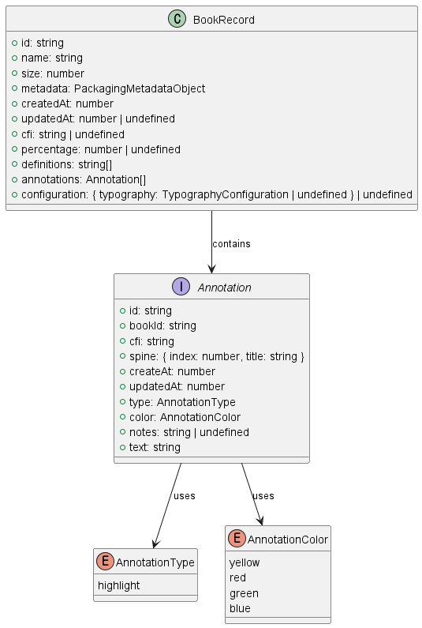
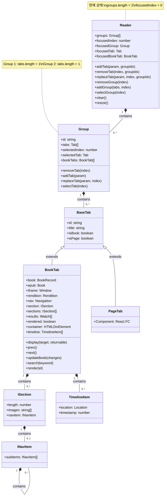
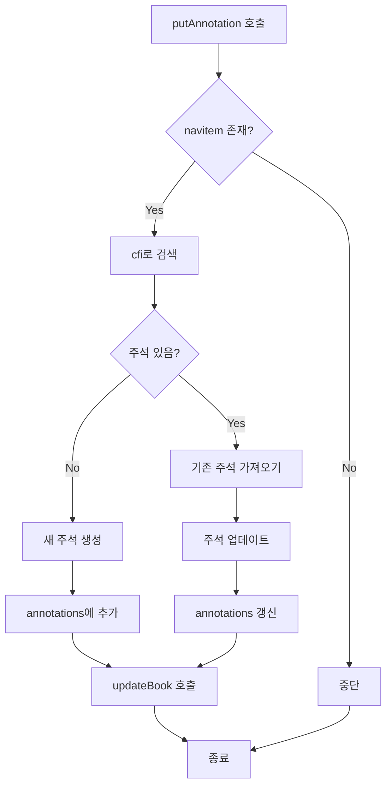
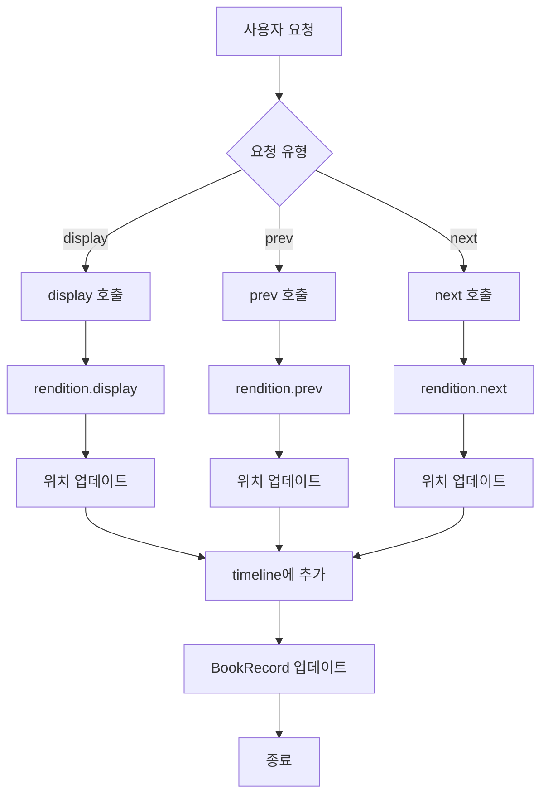
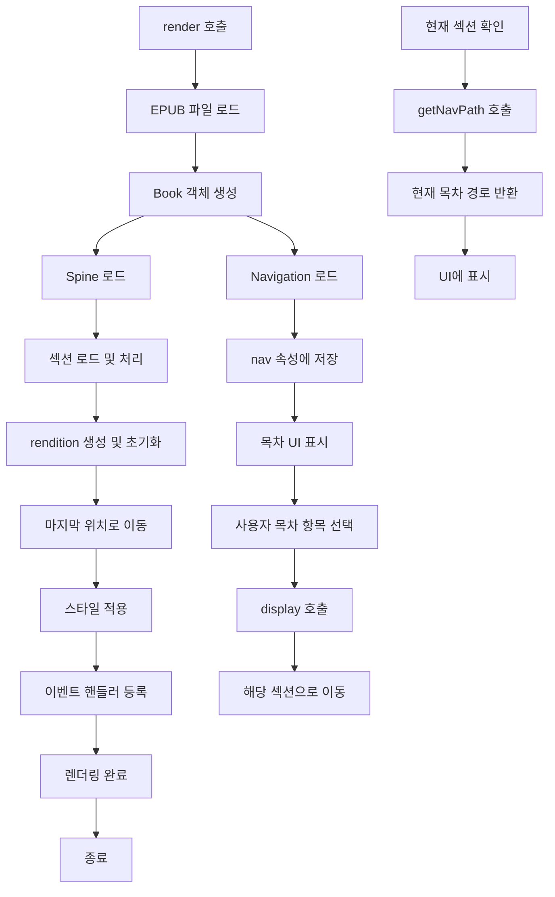

# 📖 Flow Deep Dive Sprint

## 🏃‍♂️FlowDeepDive.start("2025.03.16")

<table>
  <tr>
  <td align="center" width="200px">
      
    </td>
    <td align="center" width="200px">
      
    </td>
    <td align="center" width="200px">
      
    </td>
    <td align="center" width="200px">
      
    </td>
    <td align="center" width="200px">
      
    </td>
  </tr>

  <tr>
    <td align="center">
      <a href="https://github.com/JayChae" target="_blank">
        채종민
      </a>
    </td>
    <td align="center">
      <a href="https://github.com/Sparrowlim" target="_blank">
        임진조
      </a>
    </td>
    <td align="center">
      <a href="https://github.com/cindycho0423" target="_blank">
        조현지
      </a>
    </td>
    <td align="center">
      <a href="https://github.com/hongseoha" target="_blank">
        홍서하
      </a>
    </td>
    <td align="center">
      <a href="https://github.com/Han-wo" target="_blank">
        한상우
      </a>
    </td>
  </tr>
</table>

## 🛠️ 문제 상황

### 🧐 상황

지난 EPUB 리서치 스프린트에서 **EPUB CFI**를 활용하면 공유 기능을 이북 리더기에 쉽게 추가할 수 있음을 확인했다.
[Epub 리서치 스프린트](https://plausible-windflower-bc3.notion.site/Epub-1b2be08797b4809a9401c3d54548219c)

따라서 **이북 리더기 제작**이 팀의 다음 과제인 상황이다.

### ❌ 문제

- 팀이 리더기 제작 경험이 전무하다.
- 어떻게 만들어야 할지 전혀 모른다.
- 만들어도 형편없는 결과물이 나올 가능성이 크다.

독서 경험을 더욱 즐겁게 만들어야 하는 서비스, **핵심이 되는 뷰어가 잘 작동하지 않으면 곤란하다.**

### 💡 해결 아이디어

기존 오픈소스 이북 리더기 **"Flow"를 분석하는 "Flow Deep Dive Sprint"를 진행하자.**

## 🎯 스프린트 목표

Flow 레포지토리를 분석하여 이북 리더기 개발 역량을 강화하고, 북키위 서비스 적용 방안을 도출하고, 강력한 이력 활동을 확보해보자.

### 📌 북키위의 목표

- **이북 리더기 개발 역량 확보**

  - EPUB CFI와 **epub.js 기반의 리더기 개발 원리**를 이해한다.
  - 기존 오픈소스 리더기(Flow)의 **구조와 구현 방식을 분석하여 벤치마킹**한다.

- **기술적 리스크 최소화 및 구현 방향 설정**
  - 개발 과정에서 발생할 수 있는 **기술적 장애물을 사전 파악**하고 해결 방안을 모색한다.
  - Flow 코드를 분석하여 **북키위 서비스에 적합한 기술 스택을 정리**한다.

### 📌 커리어 목표

- **우수한 개발자의 코드 분석을 통해 실력을 향상한다.**

  - 코딩 및 설계 역량 강화

- **기존 프로젝트의 코드 리딩 및 분석 역량을 키운다.**

  - 다양한 코드베이스를 빠르게 파악하고, 협업 및 코드 리뷰 능력을 성장시킨다.

- **이력서에 어필할 수 있는 경험을 쌓는다.**
  - 레포지토리 분석 경험을 포트폴리오에 추가
  - 오픈소스 기여 경험을 통한 문제 해결 능력 강조
  - 코드 리딩 및 분석 능력 강화
  - 레거시 코드 적응력 향상
  - 학습 열정과 능력 강조

## 🔍 How to deep dive

**레포지토리의 폴더, 파일, 코드의 역할을 주석으로 정리한다.**

## 🚀 성과

**주석**

│── 📂 [.github](./.github/index.md) # GitHub 관련 설정 (FUNDING.yml)  
│── 📂 [.husky](./.husky/index.md) # Husky와 관련된 설정 파일들을 저장하는 디렉터리  
│── 📂 [.vscode](./.vscode/index.md) # VS Code 편집기 설정  
│── 📂 [apps](./apps/folder.md) # 애플리케이션 소스 코드  
│── 📂 [packages](./packages/index.md) # 모노레포에서 공통 패키지 및 라이브러리  
│── 📄 .dockerignore # Docker 빌드 시 제외할 파일 목록  
│── 📄 [.eslintrc.js](./.eslintrc.js) # ESLint 설정 파일 (코드 스타일 검사)  
│── 📄 [.gitattributes](./.gitattributes) # 특정 파일 또는 폴더의 Git 속성을 정의하는 설정 파일  
│── 📄 .gitignore # Git에서 추적하지 않을 파일 목록  
│── 📄 .npmrc # npm 및 pnpm의 동작을 커스터마이징하는 설정 파일  
│── 📄 [Dockerfile](./Dockerfile) # Docker 컨테이너 이미지를 생성하기 위한 스크립트 파일  
│── 📄 LICENSE # GNU Affero General Public License (AGPL) v3 라이선스: "이 프로젝트는 오픈소스로 자유롭게 사용 가능하지만, 수정하거나 웹 서비스로 배포하면 무조건 소스 코드를 공개해야 한다!"  
│── 📄 README.md # 프로젝트 개요 및 설명 문서  
│── 📄 [docker-compose.yml](./docker-compose.yml) # Docker Compose 설정 (멀티 컨테이너 관리)  
│── 📄 [package.json](./package.json.md) # npm 패키지 정보 및 의존성 목록  
│── 📄 pnpm-lock.yaml # pnpm 패키지 매니저의 버전 잠금 파일  
│── 📄 [pnpm-workspace.yaml](./pnpm-workspace.yaml) # pnpm 모노레포 워크스페이스 설정  
│── 📄 [prettier.config.js](./prettier.config.js) # Prettier 코드 포맷팅 설정  
│── 📄 [tsconfig.json](./tsconfig.json) # TypeScript 기본 설정 파일  
│── 📄 [tsconfig.next.json](./tsconfig.next.json) # Next.js 프로젝트의 TypeScript 설정  
│── 📄 [tsconfig.react.json](./tsconfig.react.json) # React 프로젝트 전용 TypeScript 설정  
│── 📄 [tsconfig.ts.json](./tsconfig.ts.json) # TypeScript 설정 파일  
│── 📄 [turbo.json](./turbo.json.md) # TurboRepo 빌드 시스템 설정 파일 (모노레포)

**Deep Dive**

[분석 아티클 모음 폴더](./deep-dive/)

## 모노레포 구조

[Flow 모노레포 구조와 빌드 흐름 정리(pnpm, Docker)](./deep-dive/monorepo-deep-dive/index.md)

## 데이터 구조 및 관리

### 데이터베이스 데이터

indexDB & dropbox

### 전역 상태 데이터

**Recoil**

**Valtio**

### 데이터 관리 흐름

데이터의 동기화 및 관리 흐름 구조 정리

- [indexDB란?](./deep-dive/data/indexDB.md)
- [Blob 데이터란?](./deep-dive/data/blob.md)
- [Data URL이란?](./deep-dive/data/Data%20URL.md)
- [FileReader란?](./deep-dive/data/fileReader.md)

## 컴포넌트

### TextSelectionMenu

- [TextSelectionMenu 요약](./deep-dive/components/TextSelectionMenu/TextSelectionMenu.md)
- [절대좌표,좌표개념](./deep-dive/components/TextSelectionMenu/TextSelectionMenu2.md)

### PreventFlash

- [FOUC 해결을 위한 `PreventFlash` 컴포넌트 (다크 모드 전환 시 깜빡임 방지)](./deep-dive/components/PreventFlash/PreventFlash.md)

## 유틸

### [layout](./apps/reader/src/components/base/ContextView.tsx)

- 뷰포트 내에서 앵커를 기준으로 컨텍스트 뷰의 위치를 계산하는 함수
- 텍스트 선택 후 뜨는 팝업 메뉴 위치 계산 하는 데 사용

---

## 총괄 클래스 [Reader](./deep-dive/reader/reader.md) 구조

---

### 핵심 클래스 BookTab

[BookTab 분석](./deep-dive/reader/bookTab.md)

```mermaid
flowchart TD
    BookTab["BookTab 클래스"] --> |"초기화"| Book["Book 객체(epub.js)"]
    Book --> |"로드"| SpineData["Spine 데이터(문서 논리적 순서)"]
    Book --> |"로드"| NavData["Navigation 데이터(목차)"]

    BookTab --> |"렌더링"| Rendition["Rendition 객체(epub.js)"]
    Rendition --> |"표시"| Container["Container(DOM 요소)"]

    BookTab --> |"위치 추적"| Timeline["Timeline(사용자 탐색 기록)"]
    Timeline --> |"저장"| Location["Location 객체(현재 위치)"]
    Location --> |"업데이트"| BookRecord["BookRecord(진행률, CFI 등)"]

    BookTab --> |"검색"| SearchModule["검색 기능(키워드 검색)"]
    SearchModule --> |"결과"| Results["IMatch[](검색 결과)"]

    BookTab --> |"탐색"| Navigation["탐색 기능"]
    Navigation --> |"이동"| Display["display(target)(특정 위치로 이동)"]
    Navigation --> |"이전"| Prev["prev()(이전 페이지)"]
    Navigation --> |"다음"| Next["next()(다음 페이지)"]

    BookTab --> |"주석"| Annotation["주석 기능"]
    Annotation --> |"추가"| PutAnnotation["putAnnotation()(주석 추가/수정)"]
    Annotation --> |"제거"| RemoveAnnotation["removeAnnotation()(주석 제거)"]

    BookTab --> |"정의"| Definition["정의 기능"]
    Definition --> |"추가"| Define["define()(정의 추가)"]
    Definition --> |"제거"| Undefine["undefine()(정의 제거)"]

    %% 이벤트 처리
    Rendition --> |"이벤트"| Events["이벤트 처리"]
    Events --> |"relocated"| RelocatedEvent["위치 변경 이벤트(위치, 진행률 업데이트)"]
    Events --> |"rendered"| RenderedEvent["렌더링 완료 이벤트(섹션 업데이트)"]

    %% 주요 속성 및 참조
    BookTab --> |"참조"| Section["ISection(현재 섹션)"]
    BookTab --> |"참조"| View["View 객체(현재 뷰)"]
    BookTab --> |"참조"| NavItem["INavItem(현재 탐색 항목)"]
```

### 주석 추가 기능

### 페이지 탐색 흐름

### 렌더링 및 목차 처리

## 차용 가능한 부분

### 데이터 구조

- [DB](#데이터-구조)
- [highlight](./apps/reader/src/annotation.ts)

### 라이브러리

- epubjs(epup 라이브러리)
- turbo(모노레포 도구)
- Dexie(indexDB 라이브러리)
- react-use(유용한 훅 모음)
  - usePrevious
  - useSet
  - useLocalStorage

### 유틸

- [color.ts](./apps/reader/src/color.ts)(색상 처리 유틸리티 함수)
- [platform.ts](./apps/reader/src/platform.ts)(터치 스크린인지 확인)
- [state.ts](./apps/reader/src/)(설정 전역 관리)
- [util.ts](./apps/reader/src/utils.ts)(유틸 함수들(클립보드 복사 함수 등))
- [file.ts](./apps/reader/src/utils.ts)(파일 형식 변환)
- [mime.ts](./apps/reader/src/mime.ts)(MIME 타입과 파일 확장자 간의 매핑을 정의하는 객체, .epub||.zip)
- [ContextView](./apps/reader/src/components/base/ContextView.tsx)(앵커를 기준으로 컨텍스트 뷰의 위치를 계산하는 함수, 텍스트 선택 후 뜨는 팝업 메뉴 위치 계산 하는 데 사용)

### 훅

- [useColorScheme](./apps/reader/src/hooks/theme/useColorScheme.ts) (애플리케이션의 테마 컬러 관리하는 훅)
- [useTypography](./apps/reader/src/hooks/useTypography.ts) (타이포그래피 설정을 관리하는 유틸리티 및 훅)
- [useTextSelection](./apps/reader/src/hooks/useTextSelection.ts) (사용자의 텍스트 선택을 추적하고 관리하는 훅)
- [useMobile](./apps/reader/src/hooks/useMobile.ts) (모바일 환경 감지 훅)
- [useList](./apps/reader/src/hooks/useList.ts) (가상화된 리스트를 관리하는 훅)
- [useLibrary](./apps/reader/src/hooks/useLibrary.ts) (useLiveQuery를 사용해 책 라이브러리 데이터를 실시간으로 가져오는 훅)
- [useForceRender](./apps/reader/src/hooks/useForceRender.ts) (컴포넌트를 강제로 다시 렌더링하는 훅)
- [useDisablePinchZooming](./apps/reader/src/hooks/useForceRender.ts) (핀치 줌 기능을 비활성화하는 React 훅)

### 컴포넌트

- [PreventFlash](./deep-dive/components/PreventFlash/PreventFlash.md)(FOUC 방지용)
- [TextSelectionMenu](./apps/reader/src/components/TextSelectionMenu.tsx)(전자책 리더에서 텍스트 선택 시 나타나는 컨텍스트 메뉴 구현)
- [DropZone](./apps/reader/src/components/base/DropZone.tsx)(Drop 영역 생성)
- [SplitView.tsx](./apps/reader/src/components/base/SplitView.tsx) && [PaneView.tsx](./apps/reader/src/components/base/PaneView.tsx) (화면 분할 및 크기 조정 관련 컨테이너)
- [Annotation.tsx](./apps/reader/src/components/Annotation.tsx) (하이라이트 UI 이펙트 처리, 추후 훅으로 만들어 사용해도 좋을 것 같다.)
- [Theme](./apps/reader/src/components/Theme.tsx) (루트에 박혀있는 전체 애플리케이션의 테마 설정 컴포넌트)

### 클래스

- [reader](./apps/reader/src/models/reader.ts)
- [tree](./apps/reader/src/models/tree.ts)

### 코드

- [줌 비활성화](./deep-dive/codes/zoomDisable.md)

## 🎊FlowDeepDive.end("2025.03.30")
