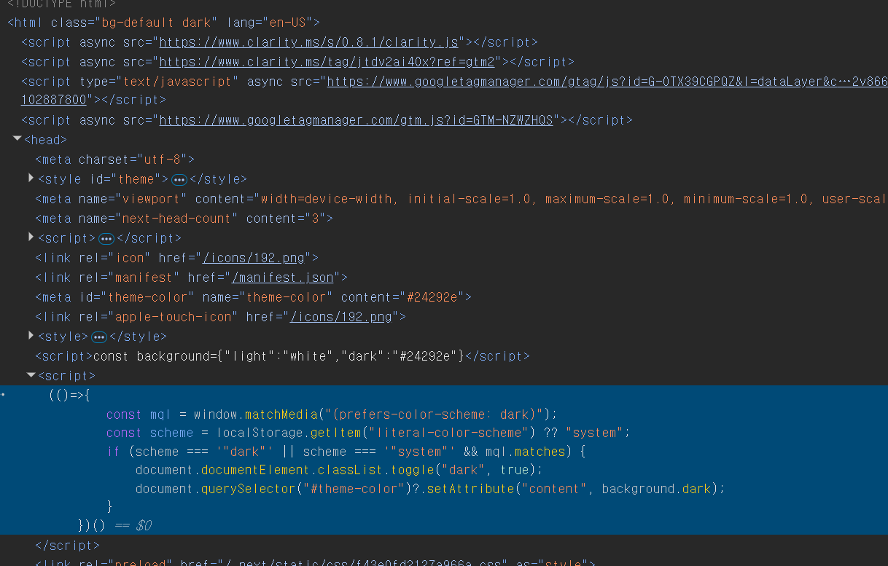

# FOUC 해결을 위한 `PreventFlash` 컴포넌트: 다크 모드 전환 시 깜빡임 방지

작성자: ☯채종민


웹 애플리케이션에서 다크 모드와 라이트 모드를 지원하는 것은 현대 사용자 경험(UX)의 필수 요소입니다. 하지만 테마 전환 시 **FOUC**(Flash of Unstyled Content)라고 불리는 깜빡임이 발생하면 사용자가 불편함을 느낄 수 있습니다. 이를 해결하기 위해 소개할 `PreventFlash` 컴포넌트는 `<head>` 태그에 위치하여 HTML 파싱 중에 미리 실행되며, 깜빡임을 방지합니다.

## 1. 깜빡임(FOUC) 문제란?

**FOUC**(Flash of Unstyled Content)는 웹 페이지가 로드될 때 잠깐 동안 잘못된 스타일이나 테마로 표시되는 현상을 뜻합니다. 특히 다크 모드와 라이트 모드 전환에서 자주 발생합니다.

### FOUC 발생 예시

- 다크 모드 사용자가 페이지를 열 때, 처음에 라이트 모드로 표시되다가 다크 모드로 전환되며 깜빡이는 경우.
- 라이트 모드 사용자가 잠깐 다크 모드 화면을 보게 되는 상황.

### FOUC의 주요 원인

1. **클라이언트 측 지연**: React의 `useEffect` 같은 훅은 컴포넌트가 화면에 렌더링된 _후에_ 실행됩니다. 이로 인해 초기 렌더링 시 기본 테마(예: 라이트 모드)가 먼저 표시되고, 이후 테마가 변경됩니다.
2. **서버 렌더링 한계**: 서버에서 HTML을 생성할 때는 사용자의 테마 선호도를 알 수 없어 기본 테마로 렌더링됩니다. 클라이언트가 테마를 적용하기 전까지 잘못된 테마가 노출됩니다.

## 2. `PreventFlash` 컴포넌트

```tsx
//_document.tsx
import { Html, Head, Main, NextScript } from 'next/document'

/**
 * Document 컴포넌트는 Next.js 애플리케이션의 HTML 문서 구조를 정의합니다.
 */
export default function Document() {
  return (
    <Html className="bg-default">
      <Head>
        {/* 다크 모드와 라이트 모드 전환 시 깜빡임을 방지 */}
        <PreventFlash />
      </Head>
      <body>
        <Main />
        <NextScript />
      </body>
    </Html>
  )
}

const background = {
  light: 'white',
  dark: '#24292e',
}

function PreventFlash() {
  const setColorScheme = () => {
    const mql = window.matchMedia('(prefers-color-scheme: dark)')
    const scheme = localStorage.getItem('literal-color-scheme') ?? 'system'
    if (scheme === '"dark"' || (scheme === '"system"' && mql.matches)) {
      document.documentElement.classList.toggle('dark', true)
      document
        .querySelector('#theme-color')
        ?.setAttribute('content', background.dark)
    }
  }

  return (
    <>
      <style>{`
        .bg-default, .hover\\:bg-default:hover {
          background: ${background.light};
        }
        .dark.bg-default, .dark .bg-default, .dark .hover\\:bg-default:hover {
          background: ${background.dark};
        }
      `}</style>

      <script
        dangerouslySetInnerHTML={{
          __html: `const background=${JSON.stringify(background)}`,
        }}
      ></script>
      <script
        dangerouslySetInnerHTML={{ __html: `(${setColorScheme})()` }}
      ></script>
    </>
  )
}
```


실제 사용 예시

### `<head>`에 위치

`PreventFlash`는 `<head>` 태그 안에 삽입되어야 합니다. 이는 브라우저가 HTML을 위에서 아래로 파싱할 때 `<head>` 내의 `<script>` 태그를 만나면 즉시 실행하기 때문입니다. 따라서 페이지 렌더링이 시작되기 전에 테마를 설정할 수 있습니다.

### 주요 기능

- **테마 확인**: 로컬 스토리지의 사용자 설정이나 시스템의 `prefers-color-scheme`를 확인합니다.
- **즉시 실행**: `<head>` 내 `<script>` 태그를 통해 HTML 파싱 중에 테마 설정 코드를 실행합니다.
- **스타일 사전 정의**: `<style>` 태그로 기본 스타일을 미리 정의해 깜빡임을 방지합니다.

## 3. `dangerouslySetInnerHTML`

- **React의 기본 원칙**: React는 보안을 위해 JSX라는 안전한 방식으로만 HTML을 생성하게 해요. 그래서 `<div>`나 `<p>` 같은 태그는 괜찮지만, 직접 `<script>` 태그나 HTML 문자열을 삽입하려고 하면 제대로 작동하지 않습니다.
- **`dangerouslySetInnerHTML`**: 이 속성은 React에게 "이 HTML 코드를 그대로 DOM에 넣어줘"라고 지시하는 방법입니다.

### `dangerouslySetInnerHTML` 사용 이유

React에서 `dangerouslySetInnerHTML`을 사용하는 가장 큰 이유는 **클라이언트 측에서 즉시 실행되는 JavaScript 코드를 삽입하거나, React 변수와 함수를 브라우저에 전달해야 할 때**입니다. 일반적인 JSX로는 이런 작업이 안 되지 않습니다.

#### 예시 1: `<script>` 태그로 콘솔 출력하기

- **목표**: 페이지에 `<script>` 태그를 넣어서 "Hello"를 콘솔에 출력하고 싶은 경우.
- **잘못된 방법**:
  ```tsx
  function MyComponent() {
    return <script>console.log('Hello')</script>
  }
  ```
  이 코드는 동작하지 않습니다. React는 JSX에서 `<script>` 태그를 사용하면 보안상의 이유로 스크립트가 실행되지 않도록 처리합니다. 그래서 `<script>console.log('Hello')</script>`는 DOM에 추가되지만, `console.log('Hello')`가 실행되지 않습니다.
- **올바른 방법**:
  ```tsx
  function MyComponent() {
    return (
      <script
        dangerouslySetInnerHTML={{ __html: "console.log('Hello')" }}
      ></script>
    )
  }
  ```
  - 이렇게 하면 브라우저가 `<script>console.log('Hello')</script>`를 제대로 실행해서 콘솔에 "Hello"를 출력합니다.
  - **왜 필요했나?**: React가 `<script>`를 실행하지 않으니까, `dangerouslySetInnerHTML`로 강제로 HTML을 삽입합니다.

#### 예시 2: React 변수 전달하기

- **목표**: React에서 정의한 변수를 클라이언트 측 JavaScript에서 사용하고 싶은 경우.
- **코드**:
  ```tsx
  function MyComponent() {
    const myVar = 'Hello from React'
    return (
      <>
        <script
          dangerouslySetInnerHTML={{ __html: `const myVar = "${myVar}";` }}
        ></script>
        <script
          dangerouslySetInnerHTML={{ __html: `console.log(myVar);` }}
        ></script>
      </>
    )
  }
  ```
  - **결과**: 브라우저 콘솔에 "Hello from React"가 출력.
  - **설명**:
    1. 첫 번째 `<script>`는 React의 `myVar` 값을 클라이언트에 전달.
    2. 두 번째 `<script>`는 그 값을 사용해서 콘솔에 출력.
  - **왜 필요했나?**: React 컴포넌트 안의 변수(`myVar`)는 클라이언트 측 JavaScript에서 바로 접근할 수 없습니다. `dangerouslySetInnerHTML`로 `<script>`를 통해 값을 전달해야만 브라우저가 인식할 수 있습니다.

#### `PreventFlash` 예시

```tsx
const background = {
  light: 'white',
  dark: '#24292e',
}
function PreventFlash() {
 ...
  return (
    <>
      ...

      <script
        dangerouslySetInnerHTML={{
          __html: `const background=${JSON.stringify(background)}`,
        }}
      ></script>
      <script
        dangerouslySetInnerHTML={{ __html: `(${setColorScheme})()` }}
      ></script>
    </>
  )
}
```

1. **첫 번째 `<script>`**:

   - **목적**: `background` 객체를 클라이언트 측에 전달합니다.
   - **왜 필요해요?**: `setColorScheme` 함수가 `background.dark` 같은 값을 사용하려면, 이 객체를 브라우저가 알아야 해요. JSX로는 변수 전달이 안 되니까 `dangerouslySetInnerHTML`로 삽입합니다.

2. **두 번째 `<script>`**:
   - **목적**: `setColorScheme` 함수를 페이지 로드 시점에 바로 실행합니다.
   - **왜 필요해요?**: 페이지가 로드되자마자 테마를 설정해서, 사용자가 라이트 모드와 다크 모드 전환으로 깜빡이는 걸 보지 않게 합니다.

### `dangerouslySetInnerHTML` 안전성

- **안전한 경우**: 위 코드처럼 개발자가 직접 작성한 데이터(`background`)와 함수(`setColorScheme`)를 사용할 때는 보안 문제가 없습니다.
- **위험한 경우**: 사용자가 입력한 값(예: `<script>alert('해킹')</script>`)을 `dangerouslySetInnerHTML`에 넣으면 악성 코드가 실행될 수 있어요. 하지만 이런 경우가 아니라면 괜찮습니다.

`dangerouslySetInnerHTML`를 쓰지 않으면 어떻게 될까요?

## 4. 사용하지 않았을 경우

```tsx
import { useEffect } from 'react'

function App() {
  useEffect(() => {
    const theme = localStorage.getItem('theme') || 'light'
    document.documentElement.classList.add(theme)
  }, [])

  return <div>컨텐츠</div>
}
```

### 과정

1. 서버에서 기본 테마(라이트 모드)로 HTML을 렌더링합니다.
2. 브라우저가 HTML과 CSS를 로드해 라이트 모드로 화면을 표시합니다.
3. React가 마운트되고 `useEffect`가 실행되어 로컬 스토리지에서 `them` 정보를 가져옵니다.
4. 화면이 라이트에서 다크로 바뀌며 깜빡임이 발생합니다.

## 5. 사용한 경우

`PreventFlash`가 `<head>`에 위치하여 HTML 파싱 중에 실행되는 점이 핵심입니다.

### 브라우저 렌더링 단계

1. **HTML 파싱**: HTML을 다운로드하고 DOM 트리를 생성합니다.
2. **CSS 파싱**: CSS를 파싱해 CSSOM을 만듭니다.
3. **렌더 트리 생성**: DOM과 CSSOM을 결합해 렌더 트리를 생성합니다.
4. **레이아웃**: 요소의 크기와 위치를 계산합니다.
5. **페인팅**: 화면에 픽셀을 그립니다.

### `<head>`에서 `<script>` 실행

- 브라우저는 HTML을 위에서 아래로 파싱하며, `<head>` 내 `<script>`를 만나면 파싱을 멈추고 스크립트를 실행합니다.
- `PreventFlash`의 `<script>`는 이 시점에 테마를 설정하므로, 렌더 트리가 생성되기 전에 올바른 테마가 적용됩니다.

### 실제 사용 예시


## 6. 렌더링 비교

| 단계           | PreventFlash 미사용    | PreventFlash 사용                       |
| -------------- | ---------------------- | --------------------------------------- |
| HTML 파싱      | 기본 테마로 진행       | `<head>`에서 `<script>` 실행, 테마 설정 |
| 렌더 트리 생성 | 기본 테마로 생성       | 올바른 테마로 생성                      |
| 페인팅         | 라이트 → 다크 (깜빡임) | 처음부터 다크 모드 표시                 |

## 7. 정리

```tsx
// 라이트 모드와 다크 모드의 배경색을 정의합니다.
const background = {
  light: 'white',
  dark: '#24292e',
}

/**
 * PreventFlash 컴포넌트는 다크 모드와 라이트 모드 전환 시 깜빡임을 방지합니다.
 * - 초기 렌더링 시 사용자의 테마 선호도(로컬 스토리지 또는 시스템 설정)에 따라 올바른 스타일을 적용합니다.
 * - `dangerouslySetInnerHTML`을 사용하여 `<script>` 태그에 클라이언트 측에서 즉시 실행되는 JavaScript 코드를 삽입하며,
 *   이는 외부 import가 빠른 새로고침(fast refresh)을 방해하기 때문에 여기서 직접 구현됩니다.
 * - 목적: 페이지 로드 시 테마 전환으로 인한 깜빡임(FOUC)을 방지하고 사용자 경험을 개선합니다.
 * @returns {JSX.Element} 스타일과 스크립트를 포함한 JSX 요소
 */
function PreventFlash() {
  // setColorScheme 함수는 클라이언트 측에서 테마를 설정합니다.
  const setColorScheme = () => {
    // 시스템의 다크 모드 선호 여부를 확인합니다.
    const mql = window.matchMedia('(prefers-color-scheme: dark)')
    // 로컬 스토리지에서 사용자 테마 설정을 가져오며, 기본값은 'system'입니다.
    const scheme = localStorage.getItem('literal-color-scheme') ?? 'system'

    // 다크 모드 조건: 사용자가 'dark'를 선택했거나, 'system'이고 시스템이 다크 모드일 때
    if (scheme === '"dark"' || (scheme === '"system"' && mql.matches)) {
      // HTML 요소에 'dark' 클래스를 추가하여 다크 모드 스타일을 적용합니다.
      document.documentElement.classList.toggle('dark', true)
      // 테마 색상을 다크 모드 배경색으로 업데이트합니다.
      document
        .querySelector('#theme-color')
        ?.setAttribute('content', background.dark)
    }
  }

  return (
    <>
      {/* 배경색을 정의하는 CSS 스타일을 삽입합니다. */}
      <style>{`
        .bg-default, .hover\\:bg-default:hover {
          background: ${background.light};
        }
        .dark.bg-default, .dark .bg-default, .dark .hover\\:bg-default:hover {
          background: ${background.dark};
        }
      `}</style>
      {/* background 객체를 클라이언트 측에서 사용할 수 있도록 JSON 형태로 삽입합니다. */}
      <script
        dangerouslySetInnerHTML={{
          __html: `const background=${JSON.stringify(background)}`,
        }}
      ></script>
      {/* setColorScheme 함수를 즉시 실행하여 초기 테마를 설정합니다. */}
      <script
        dangerouslySetInnerHTML={{ __html: `(${setColorScheme})()` }}
      ></script>
    </>
  )
}
```

`PreventFlash` 컴포넌트는 `<head>` 태그에 삽입되어 HTML 파싱 중에 실행되며, 테마를 즉시 적용해 FOUC를 방지합니다.
