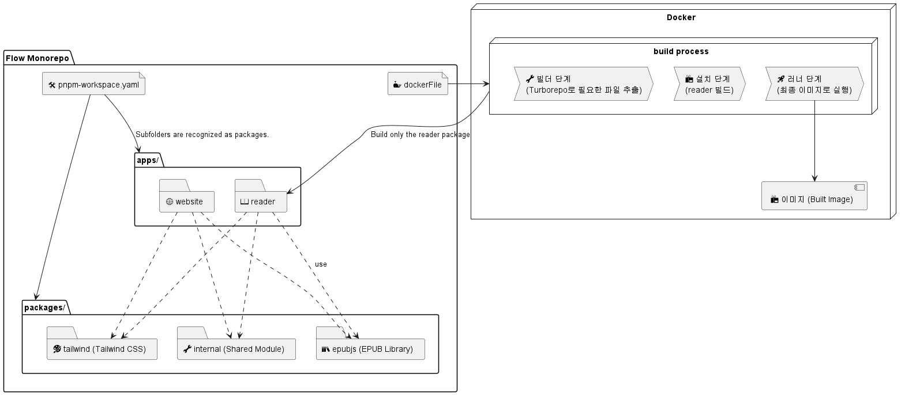

# Flow 모노레포 구조와 빌드 흐름 정리(pnpm, Docker)



## 1. **모노레포란?**

모노레포(monorepo)는 여러 프로젝트를 하나의 저장소에서 관리하는 구조다.

`@flow/monorepo`라는 이름처럼, 이 프로젝트는 여러 앱, `reader`(Flow Ebook App), `website`(Flow website)과 재사용 가능한 패키지, `epubjs`, `internal`, `tailwind` 등을 한 저장소에서 관리하고 있다. 모노레포의 장점은 다음과 같다:

- **코드 공유 쉬움**: 공통 모듈(`internal`, `tailwind`)을 앱들이 쉽게 재사용 가능하다.
- **일관된 관리**: 의존성, 빌드, 린팅 등을 한 번에 관리할 수 있다.
- **효율적인 협업**: 팀이 동일한 저장소에서 작업 가능하다.

---

## 2. pnpm과 `pnpm-workspace.yaml`와 모노레포

### pnpm이란?

pnpm은 효율적인 패키지 매니저다. npm이나 Yarn과 비슷하지만, 디스크 공간을 절약하고 빠른 설치 속도를 제공한다. **모노레포에서 특히 유용**한데, 작업 공간(workspace)을 설정해 여러 패키지를 한 번에 관리할 수 있기 때문이다.

### `pnpm-workspace.yaml`

이 파일은 pnpm이 모노레포의 구조를 이해하도록 돕는 설정 파일이다. 프로젝트의 작업 공간을 정의하며, **어떤 폴더가 패키지로 관리될지** 알려준다.

```yaml
# pnpm-workspace.yaml
packages:
  - 'apps/*' # apps 폴더 안 모든 하위 폴더를 패키지로 인식
  - 'packages/*' # packages 폴더 안 모든 하위 폴더를 패키지로 인식
```

```bash
# 폴더 구조
@flow/monorepo/
📂 apps/
 ├── 📂 reader/       # 📖 전자책 앱 (Flow Ebook App) - 하나의 패키지로 인식
 ├── 📂 website/      # 🌐 Flow 웹사이트 - 하나의 패키지로 인식

📂 packages/           # 재사용 가능한 패키지 모음
 ├── 📂 epubjs/       # 📚 EPUB 파일 라이브러리 - 하나의 패키지로 인식
 ├── 📂 internal/     # 🔧 공통 유틸리티 모듈 - 하나의 패키지로 인식
 ├── 📂 tailwind/     # 🎨 Tailwind CSS 설정 - 하나의 패키지로 인식

📄 pnpm-workspace.yaml  # 🛠️ pnpm 모노레포 설정
```

### pnpm을 사용한 의존성 연결

`reader`가 `internal`이나 `tailwind`를 의존성으로 쓰면, pnpm이 로컬 패키지를 연결한다.

```json
// apps/reader/package.json
{
  "name": "@flow/reader",
  "dependencies": {
    "@flow/internal": "workspace:*",
    "@flow/tailwind": "workspace:*"
  }
}
```

1. pnpm install을 실행하면 pnpm은 packages/internal와 packages/tailwind 폴더를 찾아서 reader에 연결한다.
2. 외부 npm 레지스트리(npmjs.com)에서 @flow/internal을 검색하거나 다운로드하지 않고, 로컬 경로(@flow/packages/internal)를 사용한다.
3. 결과적으로 node_modules/@flow/internal는 실제로는 packages/internal의 링크로 설정된다.

### 장점

보통 npm이나 Yarn을 쓰면 의존성이 node_modules에 별도로 복사되거나 다운로드된다. 하지만 pnpm은 모노레포에서 로컬 패키지를 직접 가리키므로 아래와 같은 장점이 있다.

- 네트워크 요청이 없어서 빠르다.
- 동일한 코드베이스 사용 가능
- 저장소에서 관리되는 최신 버전을 바로 반영된다(예: internal 수정 후 internal를 사용하고 있는 reader와 website에 바로 반영).
- pnpm은 중복된 의존성을 한 번만 저장하고 나머지는 하드 링크(hard link)로 참조한다. 모노레포에서 여러 패키지가 같은 의존성을 쓸 때 디스크 공간 절약된다.

### pnpm을 사용한 특정 패키지 타겟팅 빌드

#### 명령어 실행

`pnpm -F reader build`처럼 특정 패키지만 타겟팅해서 빌드 가능하다.

1. pnpm은 pnpm-workspace.yaml에서 apps/\*를 확인하고, reader 패키지를 찾아낸다.
2. reader 패키지의 package.json을 읽어 빌드한다.
3. 이 과정에서 internal은 의존성으로 참조되지만, internal의 빌드는 별도로 호출되지 않는다.

#### 장점

- 효율성:
  모노레포에 여러 앱(reader, website)과 패키지(internal, tailwind)가 있으므로, 전체를 빌드하면 시간이 오래 걸린다. reader만 수정했으면 reader만 빌드하고 싶을 때 유용하다.
- 테스트 용이성:
  개발 중 reader를 테스트하려면 reader만 빠르게 빌드해서 확인하고 싶다. 다른 패키지(website나 internal)는 건드리지 않아도 된다.
- 의존성 관리:
  reader가 internal을 의존한다고 하더라도, pnpm -F reader build는 reader의 빌드 스크립트만 실행하고, internal의 빌드는 별도로 호출하지 않는다(단, internal이 이미 빌드된 상태라면 참조).

---

## 3. Docker로 reader 빌드 과정

### 1. 빌더 단계:

```dockerfile
# 필요한 파일만 추출
# Turborepo를 사용해 @flow/reader 앱에 필요한 파일을 효율적으로 추출
FROM node:16-alpine AS builder
RUN apk add --no-cache libc6-compat  # Node.js 호환성 위해 설치
RUN apk update  # 패키지 목록 업데이트
WORKDIR /app  # 작업 디렉터리 설정
RUN yarn global add turbo  # Turborepo CLI 설치
COPY . .  # 프로젝트 파일 복사
RUN turbo prune --scope=@flow/reader --docker  # reader에 필요한 파일만 추출

```

Turborepo는 모노레포 관리 도구다.여러 패키지의 빌드, 개발, 린팅 같은 작업을 효율적으로 실행하도록 돕는다.

`turbo prune --scope=@flow/reader --docker`
명령으로 '@flow/reader' 앱에 필요한 파일만 추출
'--scope=@flow/reader'는 '@flow/reader' 패키지만 대상으로 지정
'--docker'는 Docker 빌드에 최적화된 출력(out/ 디렉터리)을 생성

### 2. 설치 단계:

```dockerfile
# 의존성 설치 및 빌드
# pnpm과 Turborepo를 활용해 reader 앱 빌드 준비
FROM node:alpine AS installer
RUN apk add --no-cache libc6-compat  # Node.js 호환성 유지
RUN apk update  # 패키지 목록 업데이트
WORKDIR /app  # 작업 디렉터리 설정
COPY .gitignore .gitignore  # git 무시 파일 복사
COPY --from=builder /app/out/json/ .  # 빌더에서 추출한 JSON 파일 복사
COPY --from=builder /app/out/pnpm-*.yaml .  # pnpm 락파일 복사
RUN corepack enable  # pnpm 활성화
RUN pnpm i --frozen-lockfile  # 의존성 설치 (락파일 고정)
COPY --from=builder /app/out/full/ .  # 전체 소스 복사
COPY turbo.json turbo.json  # Turborepo 설정 복사
COPY tsconfig.*json .  # TypeScript 설정 복사
RUN DOCKER=1 pnpm -F reader build  # reader만 타겟팅한 빌드 실행
```

`RUN DOCKER=1 pnpm -F reader build` 명령어를 통해 reader만 빌드 한 것을 확인할 수 있다.

### 3. 러너 단계:

```dockerfile
# 최종 실행 이미지
# 경량화된 이미지로 reader 앱 실행 준비
FROM node:alpine AS runner
WORKDIR /app  # 작업 디렉터리 설정
RUN addgroup --system --gid 1001 nodejs  # 비루트 그룹 생성
RUN adduser --system --uid 1001 nextjs  # 비루트 사용자 생성
USER nextjs  # 보안을 위해 비루트 사용자 사용
COPY --from=installer /app/apps/reader/next.config.js .  # reader 설정 복사
COPY --from=installer /app/apps/reader/package.json .  # reader 패키지 정보 복사
COPY --from=installer --chown=nextjs:nodejs /app/apps/reader/.next/standalone ./  # 빌드 결과물 복사
COPY --from=installer --chown=nextjs:nodejs /app/apps/reader/.next/static ./apps/reader/.next/static  # 정적 파일 복사
CMD node apps/reader/server.js  # reader 앱 실행
```

## 4. 요약

@flow/monorepo는 모노레포 구조를 활용해 reader(Flow Ebook App), website(Flow website), 그리고 재사용 가능한 패키지(epubjs, internal, tailwind)를 효율적으로 관리한다.
