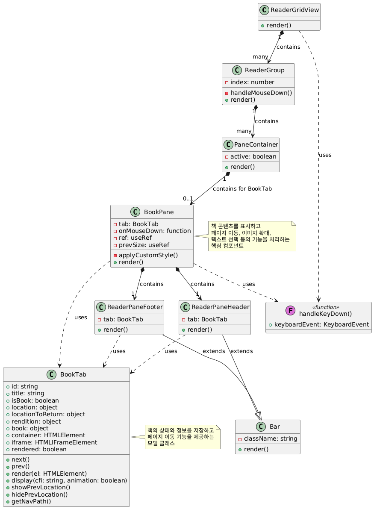

## 리더 컴포넌트 구조 설명

작성자: 조현지

1. **ReaderGridView**:

   - 최상위 컴포넌트로, 여러 ReaderGroup을 그리드 형태로 표시한다.
   - 키보드 이벤트를 감지하여 포커스된 책 탭의 페이지 이동을 처리한다.

2. **ReaderGroup**:

   - 책 그룹을 나타내는 컴포넌트이다.
   - 탭 목록과 현재 선택된 탭의 콘텐츠를 표시한다.
   - 마우스 다운 이벤트가 발생하면 해당 그룹을 선택한다.

3. **PaneContainer**:

   - 탭 콘텐츠를 담는 컨테이너이다.
   - active 속성에 따라 표시 여부가 결정된다.

4. **BookPane**:

   - 책 탭의 콘텐츠를 표시하는 주요 컴포넌트이다.
   - 책 페이지를 렌더링하고, 페이지 이동, 이미지 확대, 텍스트 선택 등의 기능을 제공한다.
   - 다양한 이벤트 핸들러(클릭, 터치, 스와이프 등)를 포함한다.

5. **ReaderPaneHeader**:

   - 책의 현재 위치와 네비게이션 경로를 표시한다.

6. **ReaderPaneFooter**:

   - 책의 현재 위치, 진행률, 이전 위치로 돌아가는 버튼 등을 표시한다.

7. **Bar**:

   - Header와 Footer의 기본 스타일을 제공하는 컴포넌트이다.

8. **BookTab**:
   - 책 정보와 상태를 관리하는 모델 클래스이다.
   - 페이지 이동, 위치 표시, 네비게이션 경로 등의 기능을 제공한다.

## 주요 기능 흐름

1. **페이지 이동**:

   - 키보드 화살표 키, 스페이스바: handleKeyDown 함수가 처리한다.
   - 스와이프: BookPane의 touchstart/touchend 이벤트 핸들러가 처리한다.
   - 화면 가장자리 클릭: BookPane의 click 이벤트 핸들러가 처리한다.

2. **사용자 정의 스타일 적용**:

   - BookPane의 applyCustomStyle 함수가 타이포그래피 설정을 적용한다.
   - 다크 모드/라이트 모드에 따라 색상을 조정한다.

3. **책 탭 선택**:

   - ReaderGroup에서 탭을 클릭하면 해당 탭을 선택한다.
   - 선택된 탭의 콘텐츠가 PaneContainer를 통해 표시된다.

4. **드래그 앤 드롭**:

   - 탭이나 파일을 드래그하여 새 그룹을 생성하거나 기존 그룹에 추가할 수 있다.

5. **이미지 확대**:

   - 이미지를 클릭하면 PhotoSlider를 통해 확대해서 볼 수 있다.

6. **반응형 레이아웃**:
   - ResizeObserver를 사용하여 크기 변화를 감지하고 리더를 리사이징한다.
   - 모바일 환경에서는 터치 이벤트를 활용하여 사용자 경험을 최적화한다.

이 리더 컴포넌트는 다양한 React 훅과 외부 라이브러리를 활용하여 e-book 리더의 기능을 구현하고 있으며, 모바일과 데스크톱 환경 모두에서 최적화된 사용자 경험을 제공하기 위한 다양한 기능을 포함하고 있다.

