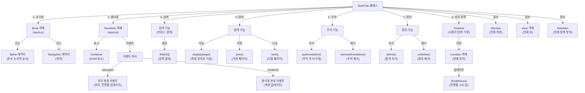
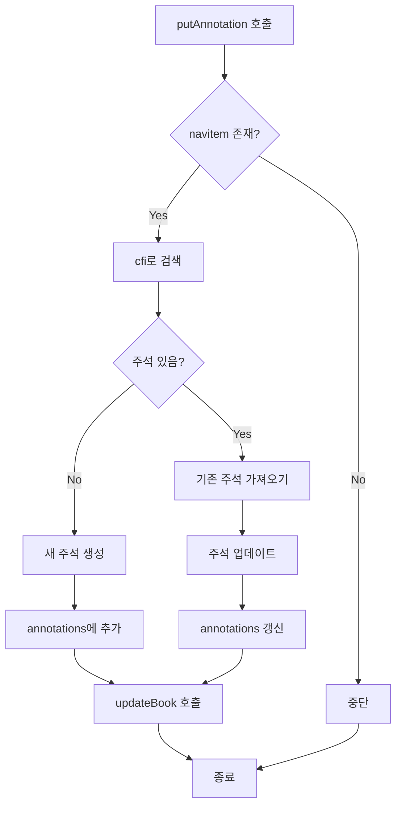

# 탑다운 방향 플로우 차트(TD)



# put-annotation



# 탐색

````mermaid
flowchart TD
    A[사용자 요청] --> B{요청 유형}
    B -->|display| C[display 호출]
    B -->|prev| D[prev 호출]
    B -->|next| E[next 호출]

    C --> F[rendition.display]
    D --> G[rendition.prev]
    E --> H[rendition.next]

    F --> I[위치 업데이트]
    G --> J[위치 업데이트]
    H --> K[위치 업데이트]

    I --> L[timeline에 추가]
    J --> L
    K --> L

    L --> M[BookRecord 업데이트]
    M --> N[종료]
    ```
````

# 랜더

````mermaid
flowchart TD
    A[render 호출] --> B[EPUB 파일 로드]
    B --> C[Book 객체 생성]
    C --> D[Navigation 로드]
    C --> E[Spine 로드]
    E --> F[섹션 로드 및 처리]
    F --> G[rendition 생성 및 초기화]
    G --> H[마지막 위치로 이동]
    H --> I[스타일 적용]
    I --> J[이벤트 핸들러 등록]
    J --> K[렌더링 완료]
    K --> L[종료]
    ```
````
