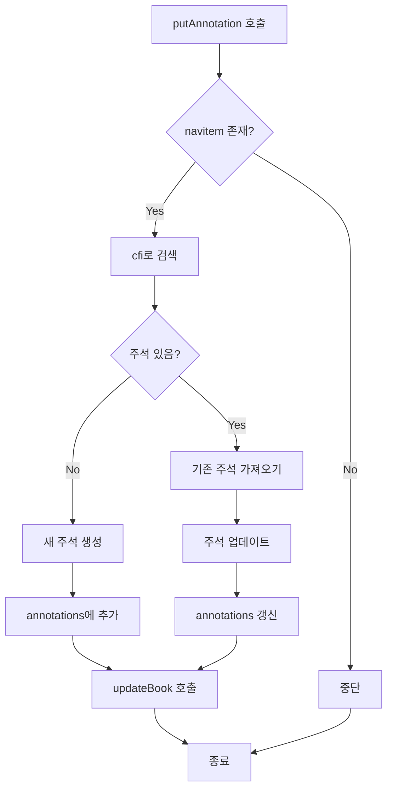
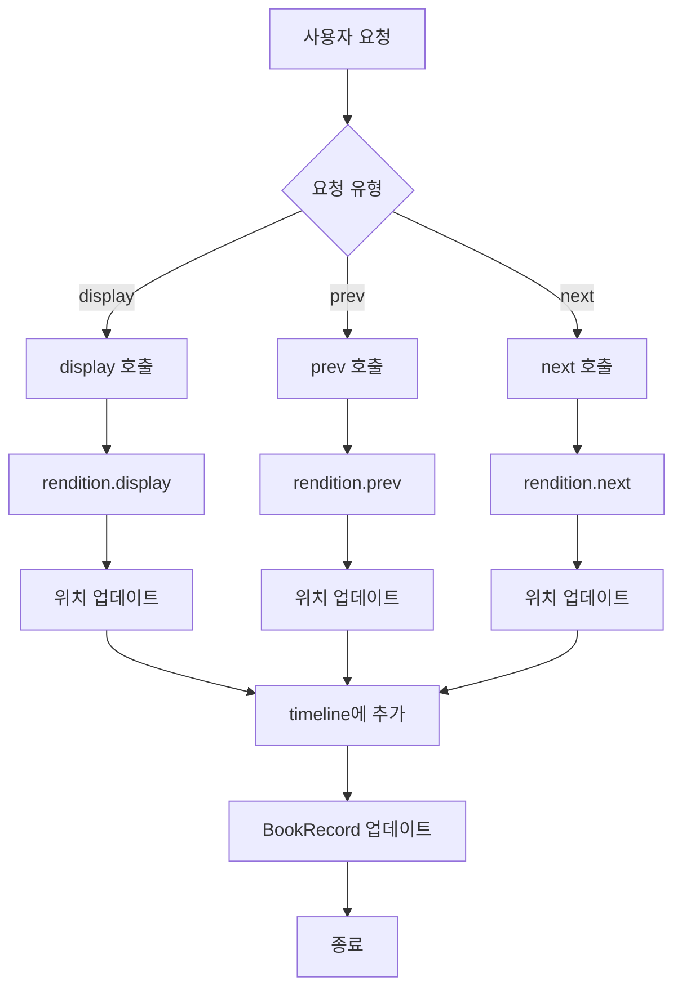
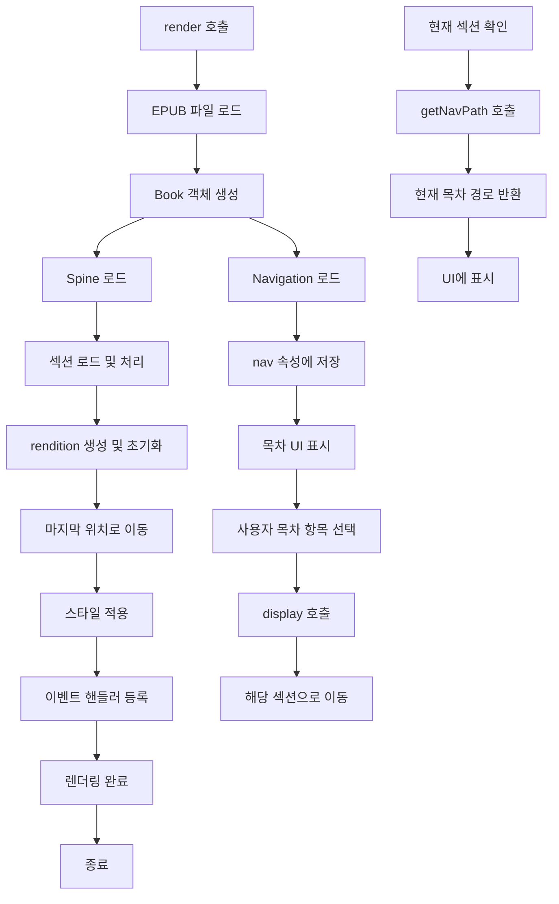

# EPUB 전자책 리더: BookTab 클래스 다이어그램 및 흐름

이 문서는 EPUB 전자책 리더 애플리케이션의 핵심 클래스인 **BookTab**의 주요 기능과 흐름을 Mermaid 플로우차트로 시각화한 것입니다. 각 다이어그램은 BookTab의 특정 기능(초기화, 렌더링, 탐색, 주석 등)을 단계별로 설명하며, 코드 이해와 설계 검토에 유용합니다. **팀원과의 협업 및 리뷰**에 활용하기 위해 작성되었습니다.

---

## 전체 개요

**BookTab** 클래스는 EPUB 전자책을 화면에 표시하고, 사용자가 책을 읽고 상호작용할 수 있도록 하는 **핵심 컴포넌트**입니다. 아래 다이어그램은 BookTab의 주요 기능과 그 흐름을 **Top-Down 방식**으로 보여줍니다.

```mermaid
flowchart TD
    BookTab["BookTab 클래스"] --> |"1. 초기화"| Book["Book 객체(epub.js)"]
    Book --> |"로드"| SpineData["Spine 데이터(문서 논리적 순서)"]
    Book --> |"로드"| NavData["Navigation 데이터(목차)"]

    BookTab --> |"2. 렌더링"| Rendition["Rendition 객체(epub.js)"]
    Rendition --> |"표시"| Container["Container(DOM 요소)"]

    BookTab --> |"3. 위치 추적"| Timeline["Timeline(사용자 탐색 기록)"]
    Timeline --> |"저장"| Location["Location 객체(현재 위치)"]
    Location --> |"업데이트"| BookRecord["BookRecord(진행률, CFI 등)"]

    BookTab --> |"4. 검색"| SearchModule["검색 기능(키워드 검색)"]
    SearchModule --> |"결과"| Results["IMatch[](검색 결과)"]

    BookTab --> |"5. 탐색"| Navigation["탐색 기능"]
    Navigation --> |"이동"| Display["display(target)(특정 위치로 이동)"]
    Navigation --> |"이전"| Prev["prev()(이전 페이지)"]
    Navigation --> |"다음"| Next["next()(다음 페이지)"]

    BookTab --> |"6. 주석"| Annotation["주석 기능"]
    Annotation --> |"추가"| PutAnnotation["putAnnotation()(주석 추가/수정)"]
    Annotation --> |"제거"| RemoveAnnotation["removeAnnotation()(주석 제거)"]

    BookTab --> |"7. 정의"| Definition["정의 기능"]
    Definition --> |"추가"| Define["define()(정의 추가)"]
    Definition --> |"제거"| Undefine["undefine()(정의 제거)"]

    %% 이벤트 처리
    Rendition --> |"이벤트"| Events["이벤트 처리"]
    Events --> |"relocated"| RelocatedEvent["위치 변경 이벤트(위치, 진행률 업데이트)"]
    Events --> |"rendered"| RenderedEvent["렌더링 완료 이벤트(섹션 업데이트)"]

    %% 주요 속성 및 참조
    BookTab --> |"참조"| Section["ISection(현재 섹션)"]
    BookTab --> |"참조"| View["View 객체(현재 뷰)"]
    BookTab --> |"참조"| NavItem["INavItem(현재 탐색 항목)"]
```

### 주요 기능 요약

- **초기화**: EPUB 파일을 로드하여 `Book` 객체를 생성, 목차(NavData)와 섹션 순서(SpineData) 준비.
- **렌더링**: `Rendition` 객체를 통해 책을 DOM에 표시.
- **위치 추적**: 사용자의 읽기 위치를 `Timeline`에 기록, `BookRecord`에 저장.
- **검색**: 키워드 기반 검색 기능 제공.
- **탐색**: `display`, `prev`, `next` 메서드를 통한 페이지 이동.
- **주석**: 텍스트에 주석 추가/수정/삭제.
- **정의**: 단어 정의 기능 제공.
- **이벤트**: 렌더링 완료와 위치 변경 시 이벤트 처리.

---

## 주석 추가 기능 (`putAnnotation`)

`putAnnotation()` 메서드는 사용자가 선택한 텍스트에 주석을 추가하거나 기존 주석을 수정하는 기능을 수행합니다.

### 설명

- **호출**: `putAnnotation(type, cfi, color, text, notes)` 호출.
- **유효성 검사**: 현재 섹션에 navitem이 있는지 확인. 없으면 중단.
- **검색**: cfi로 기존 주석 검색.
- **분기**: 주석이 없으면 새로 생성, 있으면 기존 주석 수정.
- **저장**: `annotations` 배열 갱신, `updateBook()` 호출하여 DB 반영.

---

## 페이지 탐색 흐름

페이지 탐색 기능은 사용자가 책 내에서 페이지를 이동하거나 특정 위치로 점프할 수 있도록 합니다.

### 설명

- **요청**: 사용자가 `display()`, `prev()`, `next()` 중 하나를 요청.
- **실행**: `rendition` 객체가 해당 이동 수행.
- **위치 관리**: 이동 후 위치를 업데이트하고 `timeline`에 추가.
- **저장**: `BookRecord`에 현재 위치 및 진행률 저장.

---

## 렌더링 및 목차 처리

`render()` 메서드는 EPUB 책을 화면에 표시하며, 목차 관련 기능도 포함합니다.

### 설명

- **렌더링 흐름**: EPUB 파일을 로드하고, `Book` 객체로 섹션과 목차를 준비한 뒤, `rendition`으로 화면에 표시.
- **목차 로드**: Navigation 데이터를 `nav` 속성에 저장 후 UI에 표시.
- **목차 탐색**: 사용자가 목차 항목 선택 시 `display()` 호출, 해당 섹션으로 이동.
- **현재 위치 확인**: `getNavPath()`로 현재 섹션의 목차 경로를 가져와 UI에 표시.
