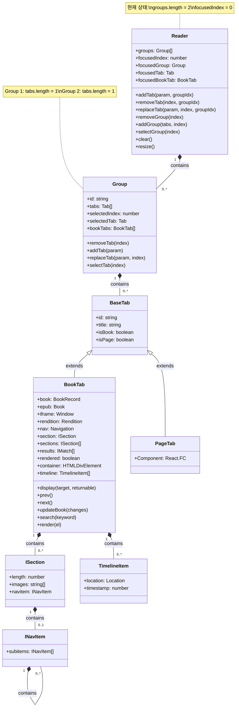

```mermaid
classDiagram
    class Reader {
        +groups: Group[]
        +focusedIndex: number
        +focusedGroup: Group
        +focusedTab: Tab
        +focusedBookTab: BookTab
        +addTab(param, groupIdx)
        +removeTab(index, groupIdx)
        +replaceTab(param, index, groupIdx)
        +removeGroup(index)
        +addGroup(tabs, index)
        +selectGroup(index)
        +clear()
        +resize()
    }

    class Group {
        +id: string
        +tabs: Tab[]
        +selectedIndex: number
        +selectedTab: Tab
        +bookTabs: BookTab[]
        +removeTab(index)
        +addTab(param)
        +replaceTab(param, index)
        +selectTab(index)
    }

    class BaseTab {
        +id: string
        +title: string
        +isBook: boolean
        +isPage: boolean
    }

    class BookTab {
        +book: BookRecord
        +epub: Book
        +iframe: Window
        +rendition: Rendition
        +nav: Navigation
        +section: ISection
        +sections: ISection[]
        +results: IMatch[]
        +rendered: boolean
        +container: HTMLDivElement
        +timeline: TimelineItem[]
        +display(target, returnable)
        +prev()
        +next()
        +updateBook(changes)
        +search(keyword)
        +render(el)
    }

    class PageTab {
        +Component: React.FC
    }

    class ISection {
        +length: number
        +images: string[]
        +navitem: INavItem
    }

    class INavItem {
        +subitems: INavItem[]
    }

    class TimelineItem {
        +location: Location
        +timestamp: number
    }

    Reader "1" *-- "0..*" Group : contains
    Group "1" *-- "0..*" BaseTab : contains
    BaseTab <|-- BookTab : extends
    BaseTab <|-- PageTab : extends
    BookTab "1" *-- "0..*" ISection : contains
    BookTab "1" *-- "0..*" TimelineItem : contains
    ISection "1" *-- "0..1" INavItem : contains
    INavItem "1" *-- "0..*" INavItem : contains

    %% 현재 상태 표현 (그룹 2개, 각각 탭 1개씩)
    note for Reader "현재 상태:\ngroups.length = 2\nfocusedIndex = 0"
    note for Group "Group 1: tabs.length = 1\nGroup 2: tabs.length = 1"

```
